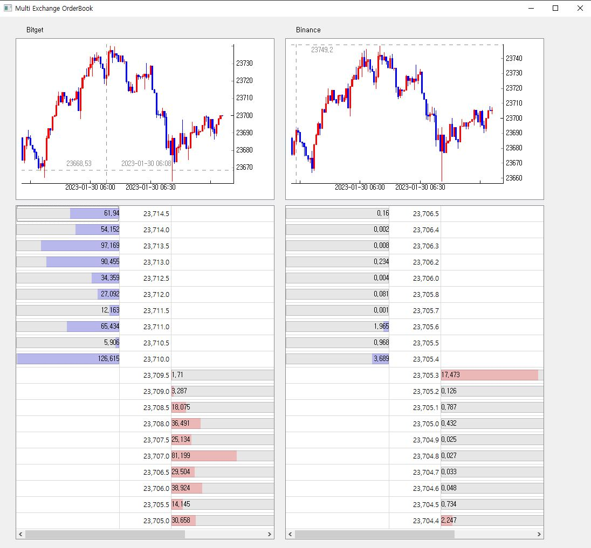

# **Bitget, Binance 거래소 실시간 Orderbook, 1m chart GUI**

## **1. 프로젝트 정보**
    
* 😀 프로젝트 구성원 : 이종원(개인프로젝트)
* 📆 프로젝트 기간  : 2023.01.28 ~ 2023.01.30
* 🤖 주요 사용 기술  : PyQt5, multi-processing, websoket, request, finpot

## **2. 🤑 프로젝트 설명**

* **✨*프로젝트 목적**
  * **🧢Market Microstructure**
    1. 호가의 움직임을 살펴보기 위한 직관적인 GUI 프로그램 생성하기.
    2. 거래량의 많은 거래소(Binance)와 적은 거래소(Bitget)의 특징 살펴보기 위한 여러 거래소를 동시에 업데이트 하기.

  * **🧢기술적 실력 향상**
    1. PyQt5를 사용한 GUI 프로그램 생성.
    2. Mult-Process와 Thread의 개념을 익히고 활용.
    3. Websocket을 사용하여 real-time data control하기

## **3. 🌈GUI 화면**

